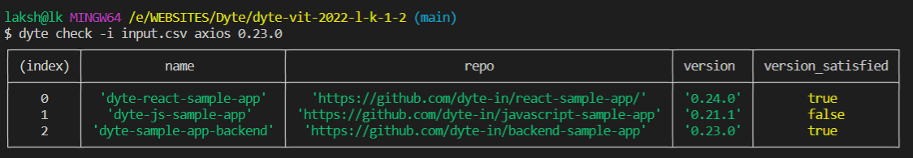
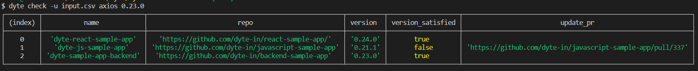

[](https://classroom.github.com/online_ide?assignment_repo_id=7943530&assignment_repo_type=AssignmentRepo)
<div id="top"></div>
<!--
*** Thanks for checking out the Best-README-Template. If you have a suggestion
*** that would make this better, please fork the repo and create a pull request
*** or simply open an issue with the tag "enhancement".
*** Don't forget to give the project a star!
*** Thanks again! Now go create something AMAZING! :D
-->


<!-- PROJECT SHIELDS -->
<!--
*** I'm using markdown "reference style" links for readability.
*** Reference links are enclosed in brackets [ ] instead of parentheses ( ).
*** See the bottom of this document for the declaration of the reference variables
*** for contributors-url, forks-url, etc. This is an optional, concise syntax you may use.
*** https://www.markdownguide.org/basic-syntax/#reference-style-links
-->

<!-- PROJECT LOGO -->
<br />
<div align="center">
<h3 align="center">CLI tool for Dyte.io</h3>
</div>


<!-- TABLE OF CONTENTS -->
<details>
  <summary>Table of Contents</summary>
  <ol>
    <li>
      <a href="#about-the-project">About The Project</a>
    </li>
    <li>
      <a href="#getting-started">Getting Started</a>
      <ul>
        <li><a href="#prerequisites">Prerequisites</a></li>
        <li><a href="#installation">Installation</a></li>
      </ul>
    </li>
    <li><a href="#Work-flow-of-application">Work flow of application</a></li>
    <li><a href="#license">License</a></li>
    <li><a href="#acknowledgments">Acknowledgments</a></li>
  </ol>
</details>


<!-- ABOUT THE PROJECT -->
## About The Project

With several different dependencies being used in node.js projects, it is important to keep these dependencies updated to the latest version. Latest depndencies are important because they have better security, better performance and several bug fixes and inhancements that make development easier. This project aims at making a CLI tool using node.js and Github API so as to check if a particular dependency is above that the required version and automatically generate a pull request(PR) requesting updation of those depndencies.

The two commands in the CLI tool are : 

To check whether the dependency satisfies a minimum version or not:

``` dyte check -i <name of csv file> <dependency of concern> <version> ```

To check and create a pr for all dependencies that donot fulfill minimum version requirement

``` dyte check -u <name of csv file> <dependency of concern> <version> ```


<p align="right">(<a href="#top">back to top</a>)</p>


<!-- GETTING STARTED -->
## Getting Started

To get started with the project, first make sure to have node.js and git bash installed on your system from [Node.js](https://nodejs.org/en/download/) and [GitBash](https://git-scm.com/downloads) 

Now choose your favourite editor, create a new folder and execute the command 

```
npm init
```

so as to initialize node.js in your folder.
### Prerequisites

Here is the list of libraries you'll be requiring to run this project:
<ul>
<li>commander</li>
<li>csv</li>
<li>download</li>
<li>fs</li>
<li>@octokit/core (from github)</li>
</ul>
You can install each of them individually or simply execute the command below on your git bash terminal


```
npm install commander csv download fs @octokit/core
```

### Installation


1. Clone the repo
    
    ```
    git clone https://github.com/l-k-1-2/dyte-vit-2022-l-k-1-2.git
    ```
1. Go to github > setting > Developer settings > Personal access tokens
2. Click on Generate new token, give it any name you like and check all the gives boxes and click generate token
3. Make sure you copy the token then and there as it disapears once to exit the screen
4. Open `commands.js` file and paste the token in 
  
    ```javascript
      const octokit = new Octokit({auth: 'You token'})  
    ```
5. Save all the changes, open the GitBash terminal in the folder and run the command4

    ```sh
    npm link
    ```


<p align="right">(<a href="#top">back to top</a>)</p>


<!-- USAGE EXAMPLES -->
## Usage

For a input of :
<table>
  <tr>
    <th> name </th>
    <th> repo </th>
  <tr>
  <tr>
    <td>dyte-react-sample-app</td>
    <td>https://github.com/dyte-in/react-sample-app/</td>
  </tr>
  <tr>
    <td>dyte-js-sample-app</td>
    <td>https://github.com/dyte-in/javascript-sample-app</td>
  </tr>
  <tr>
    <td>dyte-sample-app-backend</td>
    <td>https://github.com/dyte-in/javascript-sample-app</td>
  </tr>
</table>

Upon executing the commands, an output like below is expected in your terminal:





<p align="right">(<a href="#top">back to top</a>)</p>


<!-- 
ROADMAP
## Roadmap

- [ ] Feature 1
- [ ] Feature 2
- [ ] Feature 3
    - [ ] Nested Feature

See the [open issues](https://github.com/l-k-1-2/dyte-vit-2022-l-k-1-2/issues) for a full list of proposed features (and known issues).

<p align="right">(<a href="#top">back to top</a>)</p>-->

## Work flow of application

1. The application first reads the input that is form of a csv file and saves it as a JSON object
2. Repository owner and repository name is extracted from the csv data 
3. Using GitHub APIs and "download" module, package.json from the repo is downloaded and stored in ```./files/repo/package.json```
4. This file is parsed as a JSON object and version of required dependency is collected.
5. Version comparison of required and actual versions done and the result along with version of depenndency is stored
6. If updation is chosen and the version is unsatisfied, a new function is triggered
7. This function forks the repository, updates the package.json file and commits the changes
8. A new pr is then generated and its reference link is stored
9. At last, entire data is printed in tabular format

<p align="right">(<a href="#top">back to top</a>)</p> 


<!-- LICENSE -->
## License

Distributed under the MIT License. See `LICENSE.txt` for more information.

<p align="right">(<a href="#top">back to top</a>)</p>


<!-- CONTACT -->
## Contact

Lakshit Kothari - [lakshitkothari12gmail.com](lakshitkothari12gmail.com)

[Github](https://github.com/l-k-1-2)

[linkedin](https://www.linkedin.com/in/lakshit-kothari-6569531a1/)


Project Link: [https://github.com/l-k-1-2/dyte-vit-2022-l-k-1-2](https://github.com/l-k-1-2/dyte-vit-2022-l-k-1-2)

<p align="right">(<a href="#top">back to top</a>)</p>


<!-- MARKDOWN LINKS & IMAGES -->
<!-- https://www.markdownguide.org/basic-syntax/#reference-style-links -->
[contributors-shield]: https://img.shields.io/github/contributors/l-k-1-2/dyte-vit-2022-l-k-1-2.svg?style=for-the-badge
[contributors-url]: https://github.com/l-k-1-2/dyte-vit-2022-l-k-1-2/graphs/contributors
[forks-shield]: https://img.shields.io/github/forks/l-k-1-2/dyte-vit-2022-l-k-1-2.svg?style=for-the-badge
[forks-url]: https://github.com/l-k-1-2/dyte-vit-2022-l-k-1-2/network/members
[stars-shield]: https://img.shields.io/github/stars/l-k-1-2/dyte-vit-2022-l-k-1-2.svg?style=for-the-badge
[stars-url]: https://github.com/l-k-1-2/dyte-vit-2022-l-k-1-2/stargazers
[issues-shield]: https://img.shields.io/github/issues/l-k-1-2/dyte-vit-2022-l-k-1-2.svg?style=for-the-badge
[issues-url]: https://github.com/l-k-1-2/dyte-vit-2022-l-k-1-2/issues
[license-shield]: https://img.shields.io/github/license/l-k-1-2/dyte-vit-2022-l-k-1-2.svg?style=for-the-badge
[license-url]: https://github.com/l-k-1-2/dyte-vit-2022-l-k-1-2/blob/master/LICENSE.txt
[product-screenshot]: images/screenshot.png
